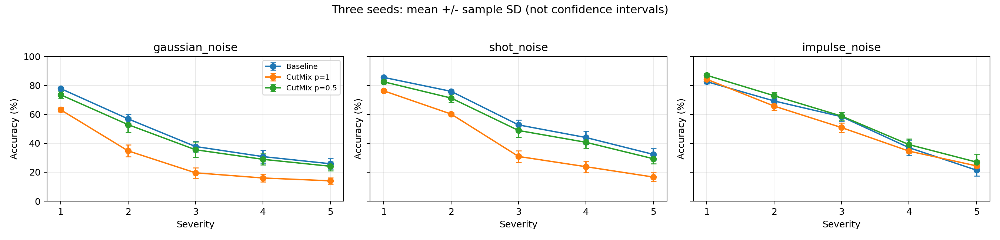
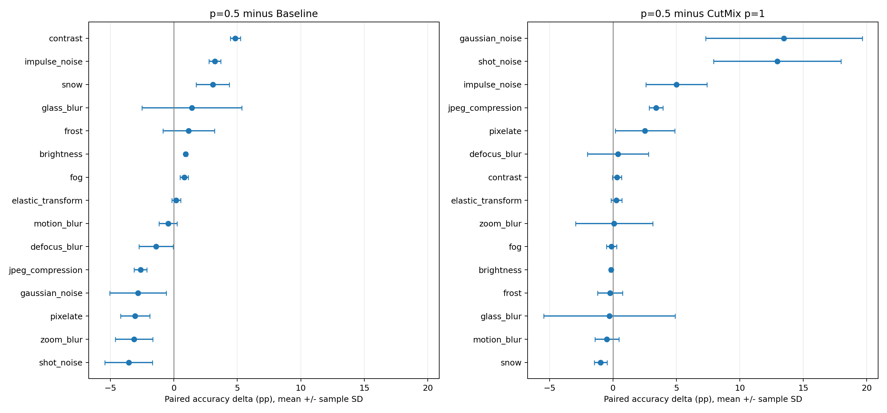
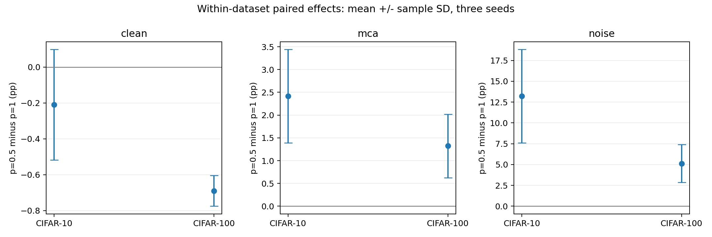
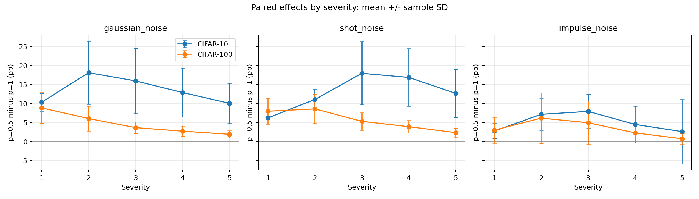

# 資料增強對影像損壞穩健性之影響：受控比較與 CutMix 使用機率分析

**Effects of Data Augmentation on Image Corruption Robustness: A Controlled Comparison and Analysis of CutMix Application Probability**

研究報告

| 封面項目 | 內容 |
|---|---|
| 作者 | Pin-Kuang Shih |
| 學校／系所 | Applied Mathematics && Computer science |
| 課程或研究計畫 | Introduction to Pattern Recognition |
| 日期 | 2026 年 6 月 17 日 |
| 文件版本 | 正式章節草稿 |

## 摘要

本研究比較五種資料增強策略對影像分類準確率與 corruption robustness 的影響，並進一步檢查 CutMix 使用頻率的敏感性。在 CIFAR-adapted ResNet-18、固定 validation 切分與三個訓練 seeds 下，AugMix Transform 取得最高平均 corruption accuracy，而 CutMix 取得最高 clean accuracy。將 CutMix 的 batch 使用機率由 1.0 降為 0.5 後，Gaussian／shot noise 平均準確率提升 13.21 個百分點，完整 mCA 提升 2.41 個百分點，但兩種 noise 的表現仍低於 Baseline。細部分析顯示，不同 corruption 類型的反應不一致，改善幅度也不隨 severity 單調增加。這些結果支持在本設定下同時評估 clean performance、corruption 類型與 augmentation 使用頻率的必要性，但未建立頻率特徵或其他機制的因果解釋。

跨資料集驗證進一步顯示，在 CIFAR-100 上降低使用機率的主要 noise 配對改善為 5.14 ± 2.29 個百分點，三個 seeds 方向一致；clean accuracy 平均下降 0.69 個百分點。兩個資料集支持有限的跨任務一致性，而非所有 corruption 均改善或真實世界普遍泛化。

**關鍵詞：**資料增強、影像損壞穩健性、CutMix、CIFAR-10、CIFAR-100。

## 目錄

1. 緒論
2. 相關工作
3. 研究方法
4. 實驗結果與分析
5. 討論與研究限制
6. 結論與未來工作
7. 參考文獻

附錄 A：數據來源；附錄 B：重現與版本紀錄。

## 1. 緒論

### 1.1 研究背景與動機

影像分類模型除了需要正確辨識原始測試影像，也需要在影像受到雜訊、模糊或壓縮等損壞時維持辨識能力。本研究將原始測試影像的分類準確率稱為 clean accuracy，將模型對上述損壞的表現稱為影像損壞穩健性（image corruption robustness）。兩者評估的輸入條件不同，因此本研究分別量測兩項表現，檢視資料增強方法的改善是否一致。

### 1.2 研究問題與貢獻

本研究依序回答三個問題：不同增強方法的 clean accuracy 排序是否能預測 corruption robustness？CutMix 在特定 corruption 上的退步是否對 batch 使用機率敏感？此敏感性在另一 CIFAR 分類任務是否仍出現？

成果包括統一模型與訓練預算下的五方法比較、三 seeds 的 CutMix 機率消融，以及在 CIFAR-100 上預先固定方向判讀規則的驗證。貢獻在於受控實驗、完整呈現正負結果與可追溯分析；不將方法組合、既有現象或 p=0.5 參數本身宣稱為新演算法。

### 1.3 研究範圍

本研究共完成 27 組訓練：18 組 CIFAR-10 與 9 組 CIFAR-100；中斷封存的 run 不計入。本文定位為受控實證比較與設定敏感性分析。

表 1　實驗階段與完成訓練數。

| 階段 | 資料集 | 比較內容 | 完成訓練數 |
|---|---|---|---:|
| 方法比較 | CIFAR-10 | 五方法 × 三 seeds | 15 |
| 使用機率消融 | CIFAR-10 | 新增 CutMix p=0.5 × 三 seeds；沿用既有對照 | 3 |
| 跨任務驗證 | CIFAR-100 | Baseline、CutMix p=1、p=0.5 × 三 seeds，全部重新訓練 | 9 |

## 2. 相關工作

Mixup 以樣本及標籤的線性插值進行訓練；CutMix 將不同影像區塊混合，依面積調整標籤權重；RandAugment 以較小的參數搜尋空間控制增強操作。[Mixup](https://arxiv.org/abs/1710.09412)、[CutMix](https://arxiv.org/abs/1905.04899)、[RandAugment](https://arxiv.org/abs/1909.13719)

AugMix 結合增強影像混合與一致性目標，其論文已比較 clean performance 和 corruption robustness，並包含 CutMix 表現落後 Standard 的 CIFAR-10-C 結果。故本研究不將此大方向描述為首次發現。本文採用 transform-only 版本，操作集合也不同於作者預設。[AugMix](https://arxiv.org/pdf/1912.02781)、[torchvision 0.21 文件](https://docs.pytorch.org/vision/0.21/generated/torchvision.transforms.AugMix.html)

CutMix 作者提供的 CIFAR-100 範例使用 probability=0.5，但其模型與訓練時程不同。這提供消融參數的參考，並不能保證在本設定最佳。此外 IPMix 補充資料已研究增強組合，故後續若探索組合亦需與相關方法區分。[CutMix 官方程式](https://github.com/clovaai/CutMix-PyTorch)、[IPMix 補充資料 Section F](https://proceedings.neurips.cc/paper_files/paper/2023/file/c917d8b9e01427f3184d80ade22f4d1f-Supplemental-Conference.pdf)

## 3. 研究方法

### 3.1 資料切分與模型訓練

兩個資料集皆將 50,000 張訓練圖片分為 45,000 張訓練及 5,000 張 validation（split seed 2026）。CIFAR-10 採固定隨機切分；CIFAR-100 採分層切分，每 fine class 留 50 張 validation。三個訓練 seeds 為 42、43、44。模型為 CIFAR-adapted ResNet-18（3×3 stride-1 初始卷積、移除初始 max pooling，分別輸出 10／100 類），訓練 100 epochs、batch size 128，採 SGD（learning rate 0.1、momentum 0.9、weight decay 0.0005）及 cosine schedule。依 validation accuracy 選擇 checkpoint，同分時保留較早 epoch，再評估 clean test。這是統一預算下的比較，不代表每種方法均已個別調至最佳超參數。

### 3.2 影像前處理與正規化

CIFAR-10 使用固定 channel mean=(0.4914, 0.4822, 0.4465)、std=(0.2470, 0.2435, 0.2616)。CIFAR-100 只從切分後的 45,000 張未增強訓練圖片計算逐 channel 像素加權 mean 與 population SD，再凍結套用至 validation、clean test 與 corruption。所有新任務的有效值均保存於設定及 checkpoint。此處理差異限制了對兩任務效果幅度差異的原因解釋。

### 3.3 資料增強設定

Baseline 使用 random crop 與 horizontal flip。Mixup 與 CutMix 的 alpha 均為 1.0；第一輪 CutMix 每 batch 都使用。RandAugment 使用 num_ops=2、magnitude=9。AugMix 採 torchvision 0.21 transform，severity=3、mixture_width=3、chain_depth=-1、alpha=1.0，沒有 JSD loss，並使用預設 all_ops=True。因此本文稱其為 AugMix Transform，而非原論文完整訓練重現。操作集合差異詳見[文獻核對](../notes/experiments/literature_audit.md)。

### 3.4 評估指標與統計方式

Corruption robustness 使用對應的 CIFAR-10-C／CIFAR-100-C，各以 15 種 corruption、五個 severity 的 accuracy 等權平均（mCA）衡量。先在每個 seed 內平均，再計算三個 seeds 的平均值及樣本標準差（ddof=1）。mCA 是 accuracy，不是以參考模型正規化的 mCE。同 seed 的 p=0.5 與對照先相減再跨 seeds 統計；不把 75 個條件當成 75 次獨立訓練，也不將兩個資料集混成六個 seeds。

全文的 ± 表示三個訓練 seeds 的樣本標準差，並非信賴區間；pp 表示百分點。所有表格由未四捨五入的原始統計值計算，再顯示至小數點後兩位。

15 種 corruption 為 Gaussian、shot、impulse noise；defocus、glass、motion、zoom blur；snow、frost、fog、brightness；contrast、elastic transform、pixelate、JPEG compression。完整 mCA 對各 corruption 等權，並非對四個大小不同的類別平均後再等權平均。Benchmark 使用公開預製資料。[Benchmark 作者資料來源](https://github.com/hendrycks/robustness)

## 4. 實驗結果與分析

### 4.1 CIFAR-10 五方法比較

表 2　CIFAR-10 五方法分類表現（平均值 ± 樣本標準差，n=3）。

| 方法 | Clean accuracy (%) | mCA (%) |
|---|---:|---:|
| Baseline | 94.42 ± 0.39 | 73.65 ± 0.26 |
| Mixup | 95.27 ± 0.15 | 78.54 ± 0.61 |
| CutMix p=1 | 95.77 ± 0.05 | 71.14 ± 0.46 |
| RandAugment | 95.03 ± 0.09 | 81.33 ± 0.34 |
| AugMix Transform | 94.83 ± 0.27 | 85.45 ± 0.44 |

三個 seeds 的 mCA 排名均相同：AugMix Transform、RandAugment、Mixup、Baseline、CutMix。CutMix 的 clean accuracy 在三個 seeds 均最高，顯示在本設定下 clean accuracy 的排序無法直接預測 corruption robustness 的排序。AugMix Transform 相對 Baseline 平均 mCA 提高 11.80 個百分點。

這類整體現象並非首次出現：AugMix 論文 Table 1 的 CIFAR-10-C 比較也呈現 CutMix 高於 Standard 的 corruption error。因此本文將其定位為不同實驗設定下的重現及細部分析，並不宣稱新穎性。[AugMix 論文](https://arxiv.org/pdf/1912.02781)

### 4.2 CutMix 使用機率消融

由第一輪結果形成的假設是：降低 CutMix 的使用頻率可能緩解 Gaussian／shot noise 上的退步。我們新增 p=0.5 的三個 seeds，其餘條件固定，並沿用 Baseline 與 p=1 對照。主要指標預先限定為 Gaussian 與 shot noise 各五個 severity 的十項平均，不包含 impulse noise。

表 3　CIFAR-10 CutMix 使用機率消融（平均值 ± 樣本標準差，n=3）。

| 方法 | Clean accuracy (%) | mCA (%) | Gaussian／shot noise (%) |
|---|---:|---:|---:|
| Baseline | 94.42 ± 0.39 | 73.65 ± 0.26 | 51.96 ± 2.69 |
| CutMix p=1 | 95.77 ± 0.05 | 71.14 ± 0.46 | 35.55 ± 2.50 |
| CutMix p=0.5 | 95.56 ± 0.30 | 73.56 ± 0.67 | 48.76 ± 3.56 |

對同 seed 配對計算後，p=0.5 相對 p=1 的 noise 差值為 +13.21 ± 5.60 pp、mCA 差值為 +2.41 ± 1.03 pp，兩者三個 seeds 皆改善。Clean accuracy 差值為 -0.21 ± 0.31 pp，兩個 seeds 下降、一個上升。相對 Baseline，p=0.5 的主要 noise 指標仍為 -3.20 ± 2.05 pp，三個 seeds 皆較低；mCA 平均差僅 -0.10 pp，但不能據此宣稱統計等效。

### 4.3 損壞類型與嚴重程度分析

降低 CutMix 使用機率後，15 種 corruption 中有九種平均改善，Gaussian、shot、impulse noise、JPEG 與 pixelate 五種在三個 seeds 都改善。其中 Gaussian、shot、impulse 的平均提升依序為 13.47、12.96、5.00 pp。另一方面，snow 與 brightness 分別平均下降 0.97、0.15 pp，且三個 seeds 皆下降。

與 Baseline 比較時，Gaussian 與 shot 在五 severity 平均後仍於三個 seeds 皆較差，但 impulse noise 卻平均高出 3.23 pp，三個 seeds 皆較好。因此不能把主要指標的結論概括為所有 noise。Gaussian 相對 p=1 的平均改善在 severity 2 最大（18.12 pp），shot 在 severity 3 最大（17.95 pp），不支持「改善隨 severity 單調增加」的描述。

圖一：各點為三個 seeds 的平均 accuracy，誤差棒為樣本 SD，不是信賴區間。

圖二：先在同 seed 配對，再跨 seeds 計算差值平均及樣本 SD。正值表示 p=0.5 高於對照。

### 4.4 CIFAR-100 與跨資料集驗證

跨資料集階段固定比較 Baseline、p=1、p=0.5，不使用 CIFAR-10 checkpoint 作 CIFAR-100 對照。主要指標沿用 Gaussian／shot noise 十項平均；設計階段指定三個 seed 配對差值皆正時，才描述為改善方向一致，並不將其解讀為正式顯著性檢定。

表 4　CIFAR-100 三種設定的分類表現（平均值 ± 樣本標準差，n=3）。

| 方法 | CIFAR-100 clean (%) | CIFAR-100 mCA (%) | Gaussian／shot noise (%) |
|---|---:|---:|---:|
| Baseline | 76.31 ± 0.41 | 47.78 ± 0.23 | 26.29 ± 0.59 |
| CutMix p=1 | 79.04 ± 0.09 | 46.26 ± 0.60 | 15.85 ± 1.47 |
| CutMix p=0.5 | 78.35 ± 0.10 | 47.58 ± 0.20 | 20.98 ± 1.00 |

表 5　各資料集內 p=0.5 相對 p=1 的配對差值（平均值 ± 樣本標準差，n=3）。

| 資料集 | p=0.5−p=1 clean (pp) | mCA (pp) | 主要 noise (pp) |
|---|---:|---:|---:|
| CIFAR-10 | -0.21 ± 0.31 | +2.41 ± 1.03 | +13.21 ± 5.60 |
| CIFAR-100 | -0.69 ± 0.09 | +1.32 ± 0.70 | +5.14 ± 2.29 |

兩資料集的三個 seeds 均改善主要 noise 指標與 mCA。CIFAR-100 的 clean accuracy 三次皆下降；p=0.5 相對 Baseline 的主要 noise 差值仍為 -5.30 ± 1.44 pp，三次皆較差。跨任務重現的是相對 p=1 的改善方向，而非恢復至 Baseline 或各方面都更好。

圖三：在各資料集內配對後計算平均與樣本 SD。橫跨任務比較的是設定改變的效果，並非兩任務的絕對 accuracy；圖中不同指標使用不同縱軸尺度。

圖四：p=0.5 減 p=1 的逐 severity 差值與樣本 SD。CIFAR-100 的 Gaussian 平均改善從 severity 1 的 8.85 pp 降至 severity 5 的 1.91 pp；shot 在 severity 2 最大（8.59 pp）。與 CIFAR-10 在 Gaussian severity 2、shot severity 3 達峰值的形態不同，不能將改善幅度描述為共同的單調 severity 規律。

Gaussian、shot、JPEG、pixelate 在兩個資料集全部三個 seeds 均優於 p=1；snow 則均下降。Impulse 平均改善，但 CIFAR-100 的一個 seed 在跨 severity 平均後為負。這進一步支持逐 corruption 報告，避免只用總 mCA 掩蓋差異。

## 5. 討論與研究限制

本結果支持一個有限的判斷：在此模型、訓練預算與資料集下，CutMix 的 corruption 表現對使用頻率敏感，降低機率可以縮小部分退步，但效果取決於 corruption 類型。這不表示 p=0.5 是最佳值，也沒有證明模型對高頻、局部紋理或邊界的依賴。

結果涵蓋單一架構、兩個 CIFAR 資料集，各條件三個 seeds。使用機率改變也改變增強抽樣的隨機序列；相同 seed 是配對設計，不表示不同方法見到完全相同的合成樣本。已觀察的 CIFAR-10-C 結果曾用於提出消融問題，因此後續消融屬探索性延伸，不是未接觸測試集上的確認實驗。本文未進行多重比較顯著性檢定。

舊對照保留設定、環境、切分及評估雜湊，但未保存當時所有未提交原始碼的快照。p=0.5 新實驗保存 source.zip 與逐檔案 SHA-256。實作 release 為 ac1ed9b，但不應把它當作舊對照的原始訓練 commit。原始 test-selected 探索結果未納入本報告統計。

## 6. 結論與未來工作

在本研究的模型與預算下，clean accuracy 的增益不保證 corruption robustness 的增益。降低 CutMix 使用頻率在兩個 CIFAR 任務均緩解部分 corruption 的退步，但伴隨平均 clean accuracy 下降，且仍未恢復主要 noise 指標至 Baseline。研究成果是具限制的實證證據鏈：方法比較、設定消融、跨任務方向驗證。

未來研究可事先固定第二模型或更不同的資料來源及評估規則，以檢視結論的適用範圍；若要解釋機制，則需直接測量與干預設計。不能只靠更多 accuracy 表格推論高頻依賴或因果關係。三 seeds、同一 CIFAR 家族及不同切分／正規化流程仍限制外推。

## 7. 參考文獻

以下以作者與題名辨識文中引用，論文連結指向原始來源；軟體文件另註明使用版本。

1. Zhang, H., Cisse, M., Dauphin, Y. N., and Lopez-Paz, D. (2017). [mixup: Beyond Empirical Risk Minimization](https://arxiv.org/abs/1710.09412). arXiv:1710.09412.
2. Yun, S., Han, D., Oh, S. J., Chun, S., Choe, J., and Yoo, Y. (2019). [CutMix: Regularization Strategy to Train Strong Classifiers with Localizable Features](https://arxiv.org/abs/1905.04899). arXiv:1905.04899.
3. [RandAugment: Practical automated data augmentation with a reduced search space](https://arxiv.org/abs/1909.13719). (2019). arXiv:1909.13719.
4. [AugMix: A Simple Data Processing Method to Improve Robustness and Uncertainty](https://arxiv.org/abs/1912.02781). (2019). arXiv:1912.02781.
5. PyTorch contributors. [torchvision.transforms.AugMix](https://docs.pytorch.org/vision/0.21/generated/torchvision.transforms.AugMix.html). torchvision 0.21 軟體文件。
6. Clova AI. [CutMix-PyTorch](https://github.com/clovaai/CutMix-PyTorch). 官方程式庫。
7. [IPMix 補充資料](https://proceedings.neurips.cc/paper_files/paper/2023/file/c917d8b9e01427f3184d80ade22f4d1f-Supplemental-Conference.pdf). (2023). NeurIPS，Section F。
8. Hendrycks et al. [robustness](https://github.com/hendrycks/robustness). Benchmark 官方資料與程式庫。

## 附錄 A：數據來源

- [五方法統計](../results/comparisons/multiseed-42-43-44/mean_std.csv)
- [消融配對統計](../results/analysis/cutmix-probability/paired_mean_std.csv)
- [逐 corruption 差值](../results/analysis/cutmix-probability/corruption_delta.csv)
- [逐 severity 差值](../results/analysis/cutmix-probability/corruption_severity_delta.csv)
- [實作與紀錄](../notes/experiments/cutmix_probability.md)

- [跨資料集配對統計](../results/analysis/cross_dataset/paired_effects.csv)
- [CIFAR-100 每 seed 結果](../results/analysis/cifar100_cutmix-probability/per_seed.csv)
- [跨資料集細部結果](../notes/experiments/cross_dataset_results.md)

## 附錄 B：重現與版本紀錄

在專案根目錄使用既有 Python 環境執行 `python3 -m scripts.compare_transfer`，會先核驗並重建兩個資料集的分析，再產生整合圖表；不進行模型訓練或推論。27 組完成 run 的檔案完整性與表格數字核對見 [定稿核對紀錄](verification.md)。實際訓練版本以各 run 的 environment/config/source archive 為準，後續報告版本不可冒充訓練版本。
